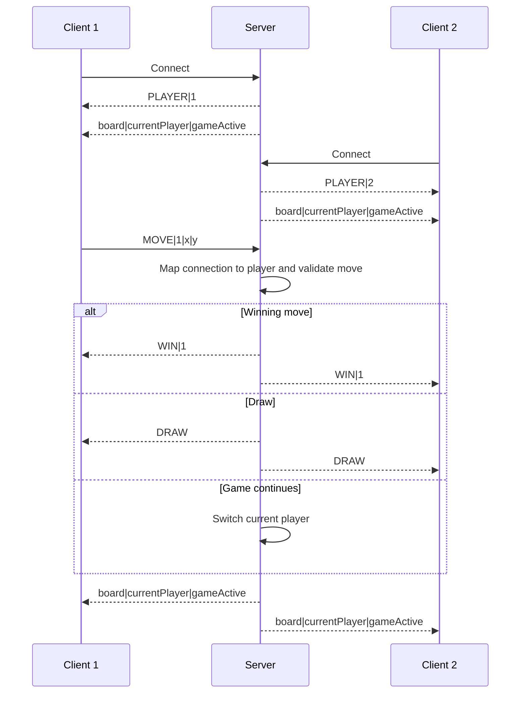

# Realtime Tic-Tac-Toe Server

Server-authoritative two-player tic-tac-toe built directly on Unity Transport. The server assigns player numbers, validates turns and occupied cells, owns the board, detects wins/draws, and broadcasts game state.

**Paired repository:** [Realtime Tic-Tac-Toe Client](https://github.com/PapiChulllo/realtime-tictactoe-client)

## Stack

- Unity `2022.3.46f1`
- Unity Transport `2.4.0`
- UDP port `9001`
- Server bind: all IPv4 interfaces
- Unity project: `TicTacToeServer/`
- Scene: `TicTacToeServer/Assets/Scenes/SampleScene.unity`

## Editor-only run order

Both repositories have empty Build Settings scene lists, so this project is documented for Editor use only. No standalone build is verified.

1. Open `TicTacToeServer/` in Unity Hub with Unity `2022.3.46f1`.
2. Open `Assets/Scenes/SampleScene.unity` and enter Play mode. The server must start first and bind UDP `9001`.
3. Open the paired client's `TicTacToeClient/` project in a separate Unity Editor and enter Play mode for Player 1.
4. Open a second local checkout/copy of that client project in another Unity Editor and enter Play mode for Player 2.
5. Click cells in the client Game views. The server permits moves only from the player whose turn it is.

The client defaults to `127.0.0.1`. For LAN use, its `IPAddress` constant in `TicTacToeClient/Assets/_Scripts/NetworkClient.cs` must point to the server host, and UDP `9001` must be allowed through the firewall.

## Authoritative flow

The server ignores the player number claimed inside `MOVE`; it uses the sending connection's assigned number. It accepts a move only while the game is active, on an empty cell, and on that player's turn, then broadcasts the resulting state.

## Message protocol

Every payload is `Encoding.Unicode` text prefixed by a transport `int` byte length and sent through `FragmentationPipelineStage` plus `ReliableSequencedPipelineStage`.

| Direction | Payload | Purpose |
| --- | --- | --- |
| Server → client | `PLAYER|<1-or-2>` | Assigns the connection's player number. |
| Server → client | `<r0>;<r1>;<r2>|<currentPlayer>|<gameActive>` | Sends three semicolon-separated rows, each containing three comma-separated cells (`0`, `1`, `2`), followed by the turn and active flag. |
| Client → server | `MOVE|<claimedPlayer>|<x>|<y>` | Requests a cell; server trusts its connection map, not `claimedPlayer`. |
| Server → clients | `WIN|<player>` | Announces a winning move. |
| Server → clients | `DRAW` | Announces a full board without a winner. |

The code also constructs a fragmentation-only pipeline, but gameplay never sends through it.

## Two-client cap and lifecycle

The first two accepted connections become Player 1 and Player 2. Later connections are closed. This is a lifetime counter, not a reusable lobby: disconnects do not remove entries from `playerNumbers`, decrement `nextPlayerNumber`, free a slot, or reset the match. `SendToAllClients` also retains disconnected connection keys.

There is no server rematch command. `ResetGame` runs only when the server starts; the similarly named client method changes local UI only and does not reset authoritative state.

## Repository map

- `TicTacToeServer/Assets/_Scripts/NetworkServer.cs` — transport lifecycle, player assignment, protocol handling, board rules, and broadcasts.
- `TicTacToeServer/Assets/Scenes/SampleScene.unity` — server Editor scene.
- `TicTacToeServer/Packages/manifest.json` — package versions.
- `TicTacToeServer/ProjectSettings/` — Unity project configuration; its build-scene list is empty.

## Limitations

- Exactly two player numbers are available per server process; disconnected slots are not reclaimed.
- There is no rematch flow, lobby, reconnect/state recovery, spectator mode, persistence, or configurable match.
- Coordinates and message parsing are not hardened against malformed or out-of-range input.
- There is no production authentication, authorization, TLS/encryption, matchmaking, rate limiting, or abuse protection.
- There are no automated tests. Unity compilation, Play mode, and builds were not verified in this documentation pass because Unity was unavailable.

See the [Realtime Tic-Tac-Toe Client](https://github.com/PapiChulllo/realtime-tictactoe-client) for the grid UI and move-request path.
